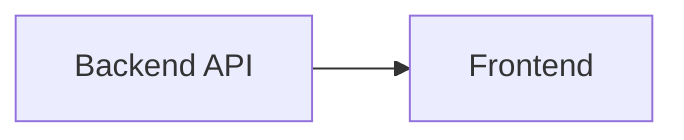
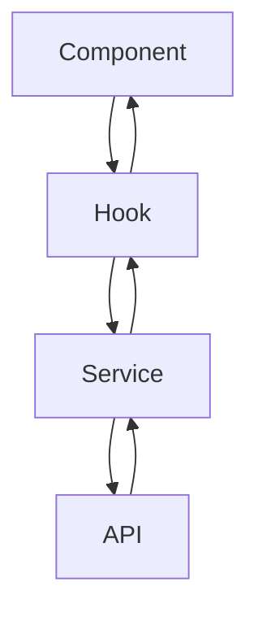

# Architecture

## Overview

The frontend is a single-page application focused on displaying telemetry data from the backend.

It is intentionally simple and does not include routing or complex state management.

---

## System Context



The frontend only communicates with the backend API.

---

## Architectural Style

The frontend follows a simple layered structure:

- UI (components)
- Hooks (logic)
- Services (API)

---

## Structure

```text id="fe503"
src/
├── app/
├── components/
├── features/
├── services/
├── hooks/
├── types/
└── utils/
```

---

## Data Flow



---

## Key Concepts

### Telemetry Event

Represents a single reading.

Used for:

- tables
- charts
- logs

---

### Latest State

Used for dashboard values.

---

### Time Series

Used for charts.

Preferred time:

1. `source_timestamp`
2. fallback to `collected_at`

---

## State Management

- local component state
- custom hooks for reuse
- no global state library

---

## Styling System

The project uses:

- TailwindCSS
- Tailwind Merge
- shared color palette

### Rules

- no hardcoded colors
- use palette tokens
- keep class lists readable

---

## Component Design

Components should be:

- reusable
- composable
- small and focused

Avoid:

- mixing data fetching and rendering
- large monolithic components

---

## Constraints

- no routing (single page)
- no global state management
- no business logic in UI
- no unnecessary abstractions

---

## Evolution Direction

- introduce routing only when needed
- introduce state management only when necessary
- expand component system gradually
- add real-time updates later if required
